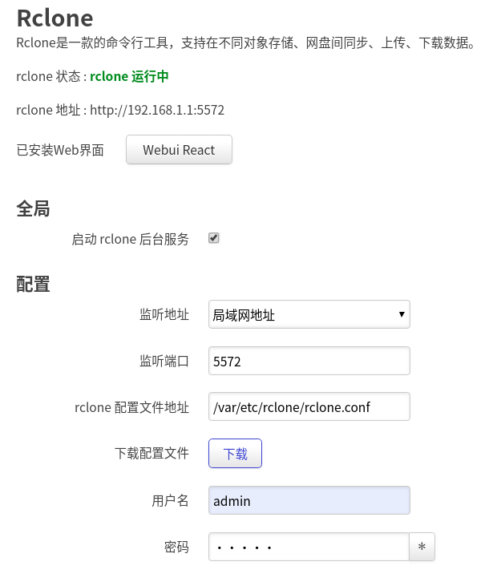

# Rclone-OpenWrt

- rclone
- rclone-webui-react
- luci-app-rclone

## Screenshot
### luci-app-rclone


### rclone-web-ui-react


## FAQ

### WebUI

Rclone address `http://192.168.1.1/rclone-webui-react/` is wrong in `rclone-web-ui-react`, and it should be replaced as `http://192.168.1.1:5572` shown at the top of `luci-app-rclone`

### Mount

Mount the remote as file system on a mountpoint

``` bash
  rclone mount remote:path /path/to/mountpoint [flags]
```

A fatal error `failed to mount FUSE fs: fusermount: exec: "fusermount": executable file not found in $PATH`  will be raised, if `fuse-utils` package isn't installed

## License
GNU General Public License v3.0
